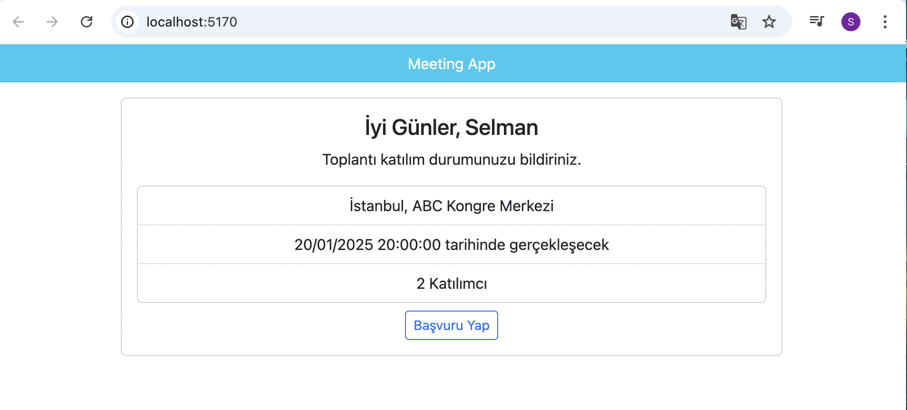
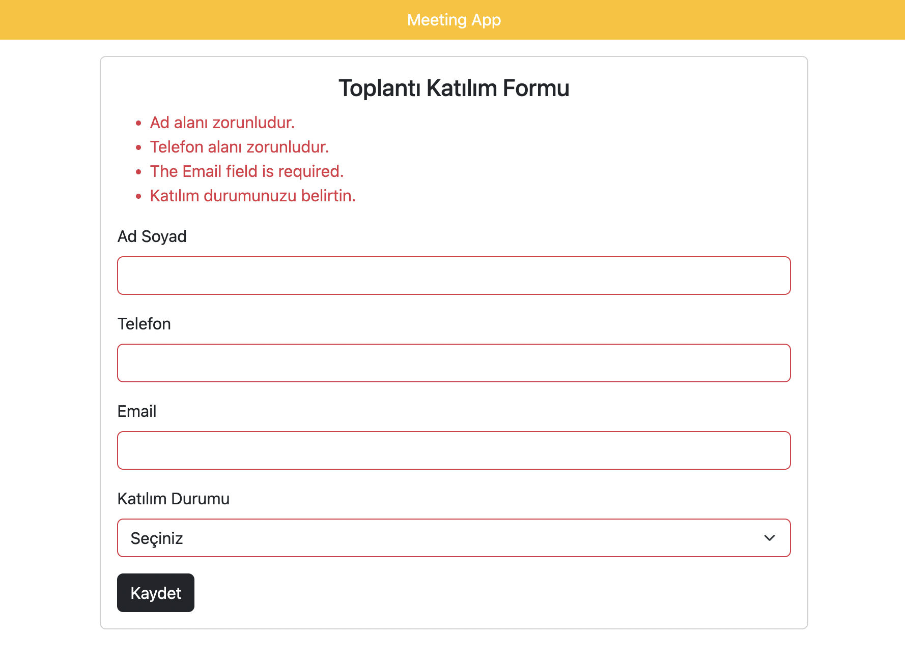
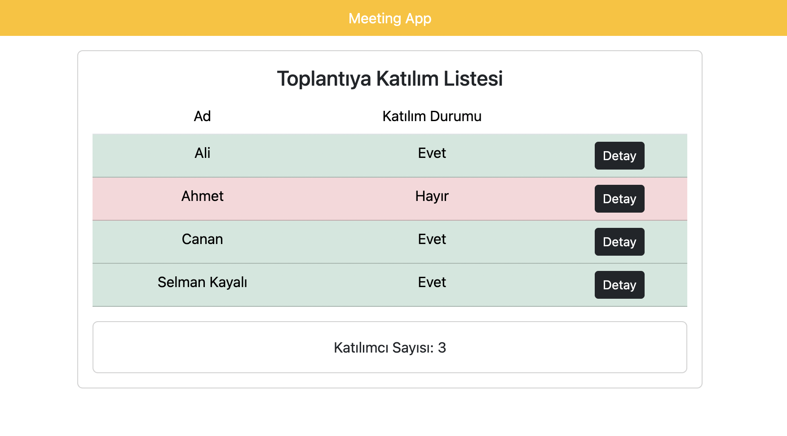

# 📝 MeetingApp

**MeetingApp**, ASP.NET Core 8.0 ile sıfırdan (Empty Template) oluşturulmuş bir MVC web uygulamasıdır. Bu proje, .NET Core'un temel kavramlarını anlamak ve uygulamak amacıyla geliştirilmiştir.

Ana sayfada yaklaşan toplantılar listelenir. Kullanıcılar, bir toplantıya katılmak için form doldurur ve katılım durumunu belirtir. Tüm alanlar zorunludur. Katılımcı listesi ve detaylar görüntülenebilir.

---

## 🚀 Technologies Used

- ASP.NET Core 8.0 MVC
- C#
- LibMan (Library Manager)
- Bootstrap (via LibMan CDN)
- Visual Studio Code (macOS)

---

## 📚 Features & Concepts

Bu projede aşağıdaki .NET Core MVC kavramları uygulanmıştır:

1. **Empty Project Setup**  
   - Proje tamamen boş (Empty) şablonla başlatılmıştır. `Controllers`, `Views`, `Models`, `wwwroot`, `Layouts` klasörleri manuel olarak oluşturulmuştur.

2. **Default Routing**  
   - Startup dosyasında `MapControllerRoute` kullanılarak klasik MVC rotalama uygulanmıştır.

3. **Controllers**  
   - Toplantılar ve katılımcılar için ayrı controller’lar oluşturulmuştur (`MeetingController`, `HomeController`).

4. **Views**  
   - Toplantı bilgilerini listeleyen ve kullanıcıdan bilgi alan dinamik `View` sayfaları tasarlanmıştır.

5. **Models**  
   - `Meeting` ve `Home` sınıfları ile veri modeli tanımlanmıştır.

6. **Layout**  
   - Sayfalarda tekrar eden kısımlar `_Layout.cshtml` içinde toplanmıştır. Sayfalar bu layout'u kullanır.

7. **Client Packages (LibMan)**  
   - Bootstrap ve diğer frontend kütüphaneleri LibMan ile `cdnjs` üzerinden projeye dahil edilmiştir.

8. **ViewBag & ViewData**  
   - Controller’dan View’a veri taşımak için `ViewBag` ve `ViewData` kullanılmıştır.

9. **Forms**  
   - Kullanıcı bilgisi girişi için `form` kullanımı yapılmıştır. Form üzerinden veri modelleme sağlanmıştır.

10. **Model Binding**  
    - Formdan gönderilen veriler, otomatik olarak ilgili model nesnelerine bağlanmıştır (`Model Binding`).

11. **Tag Helpers**  
    - Razor `Tag Helpers` (örneğin `<form asp-action="...">`) ile HTML ve C# entegrasyonu yapılmıştır.

12. **Form Validations**  
    - `Data Annotations` ile zorunlu alanlar tanımlanmış ve istemci/servis tarafı validasyon sağlanmıştır.

---

## 🖼 Screenshots

```markdown
### 🏠 Home Page


### ✍️ Meeting Form


### ✍️ Meeting Form-2


### 📋 Participants List

